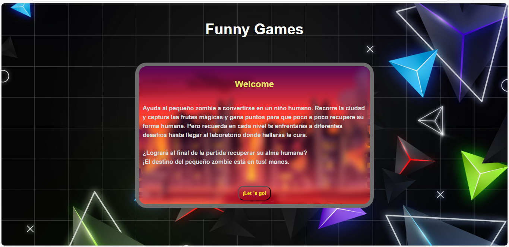

# 🧠 Zombi-Kid: ¡Recuperá tu alma!

**Zombi-Kid** es un mini juego de aventuras en el que deberás ayudar a nuestro personaje a recuperar su alma humana.  
Explorá el escenario, recolectá monedas perdidas, esquivá obstáculos y sumá puntos en este viaje por volver a ser humano.

---

## 🎮 ¿Cómo jugar?

- Usá las **flechas del teclado** para moverte:
  - ⬅️ Izquierda
  - ➡️ Derecha
  - ⬆️ Saltar
- Cada fruta que recolectás suma **+10 puntos**
- ¡No dejes que el alma de Zombi-Kid se pierda para siempre!

---

## 🖼️ Vista previa

📷 

---

## 🚀 Jugalo online

👉 [Hacé clic para jugar](fermarcos606.github.io/zombie-kid/)  

---

## 🧰 Tecnologías usadas

- HTML
- CSS (Flexbox / Grid)
- JavaScript (DOM, clases, eventos)
- GitHub Pages para publicar el juego

---

## 📁 Estructura

mi-juego/
├── index.html
├── style.css
├── main.js
├── img/
│ └── ... imágenes del juego
├── audio/
│ └── musica_fondo.mp3

---

## ✨ Fernanda Marcos

Hecho con ❤️ por **Fernanda (fermarcos606)** como parte de su práctica en desarrollo web.

---

## 🔒 Licencia

Uso educativo y personal.
